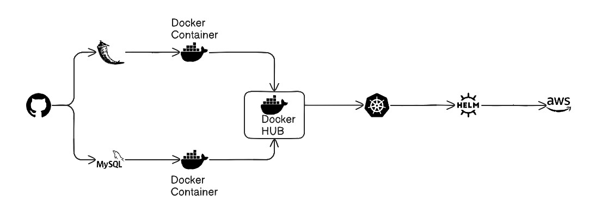

# 📝 2-Tier To-Do Application

A simple production-style 2-Tier To-Do Application built using **Flask** and **MySQL**. The application allows users to create, view, update, and delete tasks while demonstrating the architecture of a typical web application connected to a relational database.

---

## 🚀 Features

- Add new tasks
- View all tasks
- Delete tasks
- MySQL database integration
- Environment variable-based configuration
- Docker support
- Lightweight and easy to deploy

---

## 🏗️ Architecture



---

This project follows a **2-Tier Architecture**:

1. Presentation & Business Logic Layer (Flask)
2. Data Layer (MySQL)

---

## 📂 Project Structure

```text
to-do-2-tier-app/
│
├── app.py
├── requirements.txt
├── Dockerfile
├── docker-compose.yml
├── templates/
│   └── index.html
└── README.md
```

## 🛠️ Tech Stack

- Python
- Flask
- MySQL
- HTML
- CSS
- Docker
- Docker Compose

---

## ⚙️ Environment Variables

Create a `.env` file or configure the following variables:

```env
MYSQL_HOST=localhost
MYSQL_USER=root
MYSQL_PASSWORD=your_password
MYSQL_DB=todo_db
```

---

## 📦 Installation

### Clone Repository

```bash
git clone <repository-url>
cd to-do-2-tier-app
```

### Create Virtual Environment

```bash
python -m venv venv
```

### Activate Virtual Environment

#### Windows

```bash
venv\Scripts\activate
```

#### Linux/Mac

```bash
source venv/bin/activate
```

### Install Dependencies

```bash
pip install -r requirements.txt
```

---

## 🗄️ Database Setup

Login to MySQL:

```sql
CREATE DATABASE todo_db;
```

Update your environment variables accordingly.

---

## ▶️ Run Application

```bash
python app.py
```

Application will be available at:

```text
http://localhost:5000
```

---

## 🐳 Docker Deployment

### Build Image

```bash
docker build -t todo-app .
```

### Run Container

```bash
docker run -p 5000:5000 todo-app
```

---

## 🐳 Docker Compose

Start application and database:

```bash
docker-compose up -d
```

Stop containers:

```bash
docker-compose down
```

## 🎯 Learning Objectives

This project demonstrates:

- Flask Web Development
- MySQL Integration
- CRUD Operations
- Environment Variable Management
- Docker Containerization
- 2-Tier Application Architecture

---

## 👨‍💻 Author

**Siddhesh Masurkar**

Data Scientist | Machine Learning Engineer | Python Developer
